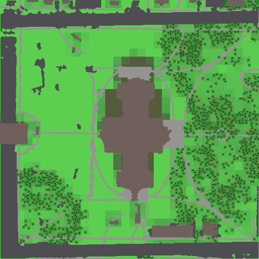

# Shot G3a — the Capitol reference run at flat rainfall

The run this reports on, and the one it is compared against:

```sh
# G3a, the reference run as it now stands
ecosim run --world worlds/capitol --seed 42 --ticks 20000 --out runs/capitol-s42 \
    --snapshot-every 100 --set animals.enabled=false --set climate.rain_gradient=0
ecosim check runs/capitol-s42                                              # check.txt
python sweeps/capitolG3/report.py runs/capitol-s42 sweeps/capitolG3-flat   # report.txt, vegetation-20000.png
python sweeps/capitolG3-flat/eastwest.py runs/capitol-s42                  # eastwest.txt

# G3, the same run with the strip's rain ramp still on (re-made here to compare)
ecosim run --world worlds/capitol --seed 42 --ticks 20000 --out runs/capitol-s42-grad06 \
    --snapshot-every 100 --set animals.enabled=false
```

256 × 256 × 32 columns over the committed `worlds/capitol` bundle, format version 4, snapshot every
100, animals off. `report.py` is shot G3's script, unchanged; `eastwest.py` is new here and splits
the site at x = 128. The comparison run reproduces shot G3 exactly (2278 trees at tick 20000, the
same cause table), so the two columns below differ in one parameter and nothing else.

**The only change is `climate.rain_gradient`: 0.6 → 0 on bundle worlds, as a per-run override.** No
default moved, nothing was tuned, and noise worlds still run with the ramp.

## 1. Event-log cause breakdown

Animals are off, so trees and ground cover are the whole log.

| species | kind | cause | G3a (flat) | G3 (ramp 0.6) |
| --- | --- | --- | --- | --- |
| tree | germination | — | 9240 | 7933 |
| tree | tree_death | drought | **3315** | 25 |
| tree | tree_death | burnt | **2055** | 17 |
| tree | tree_death | crowded | 1656 | 4075 |
| tree | tree_death | old_age | 311 | 1617 |
| ground cover | ignition | — | 75 | 89 |
| ground cover | spread | — | **576** | 81 |
| ground cover | burnout | — | 651 | 170 |

Ground cover still has no per-species rows: its only events are fire, logged against a patch with an
empty species field.

The mortality mix turns over completely. Under the ramp the site was crowding-limited (71% of deaths
crowded, 28% old age) because all the wood stood in the wet east, where trees died of each other
rather than of the weather. Flat, the same site is **disturbance-limited**: drought 45%, fire 28%,
crowding 22%, old age 4%. The two mechanisms that were nearly inert in G3 now dominate, and they are
the two the water work (G4) is about, so this is the run that shot should be read against.

**Fire is the big mover: 81 spreads become 576.** Ignition is `base_rate · f(T) · (1 − m/255)² ·
fuel` and spread is `spread · fuel · (1 − m/255)`, so a fire needs fuel and dryness *in the same
patch*. Under the ramp the site had them in different halves — fuel in the wet east (moisture 173),
dryness in the empty west — and 89 ignitions managed 81 spreads. Flat, the whole site carries fuel at
a middling moisture (139–167), so 75 ignitions spread 576 times and burn out 651 patches, taking 2055
trees with them. Every fire still ends.

## 2. Trees and canopy

| tick | G3a total | G3 total | G3a canopy cols | G3 canopy cols | G3a canopy % | G3 canopy % |
| --- | --- | --- | --- | --- | --- | --- |
| 0 | 79 | 79 | 711 | 711 | 1.6% | 1.6% |
| 10000 | 602 | 1519 | 2173 | 7533 | 5.0% | 17.2% |
| 20000 | 1982 | 2278 | 8821 | 11855 | 20.1% | 27.0% |

Canopy is per cent of the 43,831 plantable columns. Stage mix at tick 20000: 1113 mature, 41 young,
828 sapling (G3: 1602 / 4 / 672). The flat site ends with 13% fewer trees and a quarter less canopy,
and it gets there later — at tick 10000 it is a third of the way rather than two thirds — because
fire and drought keep knocking it back while it fills. It is still climbing at tick 20000.

The imported cohort behaves the same either way: all 79 are planted in the open, none ever stands in
building shade, and the last one dies between ticks 5600 and 5700 (identical to G3 — the
height-to-age map, not the weather, sets that). The Capitol's *arrangement* of trees sets the first
~5000 ticks and the canopy after that is the sim's own.

## 3. The east–west split — the acceptance line

**The west half is populated: 424 trees stand west of x = 128 at tick 20000**, against 0 in G3.

| tick | G3a west | G3a east | G3 west | G3 east |
| --- | --- | --- | --- | --- |
| 0 | 25 | 54 | 25 | 54 |
| 5000 | 73 | 615 | 1 | 675 |
| 10000 | 73 | 529 | 0 | 1519 |
| 15000 | 232 | 1018 | 0 | 1899 |
| 20000 | **424** | 1558 | **0** | 2278 |

The west never empties: its minimum over all 201 snapshots is its starting 25, at tick 0. In G3 the
last western tree died at tick 5050 and nothing came back, because `tree.seed_radius` is 6 columns
and `tree.immigration_floor` is 0.

Mean moisture by half says why:

| tick | G3a west | G3a east | G3 west | G3 east |
| --- | --- | --- | --- | --- |
| 0 | 84.0 | 87.3 | 84.0 | 87.3 |
| 5000 | 141.2 | 139.4 | 92.3 | 167.3 |
| 10000 | 162.6 | 139.3 | 58.0 | 172.8 |
| 20000 | 167.0 | 172.7 | 167.3 | 172.3 |

Flat, the two halves stay within 17% of each other all run. Under the ramp the west sat at 58 against
the east's 173 at tick 10000, with `tree.dry_moisture` = 30 and `dry_death_ticks` = 500 in between.
(The ramp's west recovers to 167 by tick 20000 — once its trees are gone nothing transpires there —
which is exactly why that collapse was irreversible rather than self-correcting.)

Tree events by half:

| event | G3a west | G3a east | G3 west | G3 east |
| --- | --- | --- | --- | --- |
| germination | 1467 | 7773 | 5 | 7928 |
| drought | 391 | 2924 | 24 | 1 |
| burnt | 357 | 1698 | 3 | 14 |
| crowded | 266 | 1390 | 0 | 4075 |
| old_age | 54 | 257 | 3 | 1614 |

**The halves are no longer two climates, but they are not yet equal:** 19.7 trees per 1000 plantable
columns in the west against 69.7 in the east (the west has 21,492 plantable columns, the east 22,339,
so the denominators are within 4%). The cause is dispersal, not water. The scene's own trees start 25
west and 54 east, the western 25 in scattered clumps and the eastern 54 in a block along the east
walk, and with `seed_radius` = 6 a woodland grows as a front from where it already is. The west's
share is rising — 3.4 per 1000 at tick 10000, 10.8 at 15000, 19.7 at 20000, while the east goes
23.7 → 45.6 → 69.7 — so at 20k ticks this is a site still being colonised from its east side, not a
site split in two. That is a starting-condition effect the operator can see in the scene; no
parameter was touched for it.

## 4. Ground and the check

Patch means over the whole site:

| tick | G3a grass | G3 grass | G3a shrub | G3 shrub | G3a detritus | G3 detritus |
| --- | --- | --- | --- | --- | --- | --- |
| 0 | 0.088 | 0.088 | 0.031 | 0.031 | 0 | 0 |
| 10000 | 0.724 | 0.602 | 0.124 | 0.155 | 752 | 717 |
| 20000 | 0.645 | 0.557 | 0.224 | 0.222 | 1404 | 1229 |

Rock 21,705 columns of 65,536 (33.1%), water 0, plantable 43,831 (66.9%), and the media split (lawn
64.8%, asphalt 17.1%, roof 9.4%, concrete 8.7%) are properties of the bundle and unchanged. Building
shade is likewise unchanged: 8701 dark surface columns, of which 2056 are plantable (4.7% of
plantable ground), still cross-checking exactly against `snap_000000/light.bin`, and **no tree stands
in shade at tick 0, 10000 or 20000** in either run. A shaded column's surface light is 0 and
`tree.light` is 60, so shade stays a hard exclusion rather than a handicap — rain does not touch it.

Grass ends higher flat (0.645 against 0.557) and detritus higher still (1404 against 1229): the west
is now lawn that grows rather than lawn that dries out, and the fires feed the litter pool.

`ecosim check runs/capitol-s42` **passes**, exit 0 (`check.txt`):

```
PASS no species reaches 0: min trees=266 [margin +265.0000]
PASS no species exceeds 10x its anchor count: trees max=2629 limit=6880 [margin +0.6179]
N/A  grazer cycle: n/a (animals off)
PASS fertility_mean in [40, 220]: [116.51, 218.33] [margin +0.0076]
PASS grass_mean in [0.05, 0.95]: [0.5022, 0.8528] [margin +0.1023]
PASS trees at end >= 1.5x trees at tick 0: 1982 vs 79 (need 118.5) [margin +15.7257]
PASS run time < 30 s per 64x64, at most 90 s: 9694 ms [margin +0.8923]
PASS mature trees at tick 10000 >= 35: 247 [margin +6.0571]
N/A  at tick 10000 grazers >= 10 and hunters >= 2: n/a (animals off)
```

Wall time **9694 ms** for 20000 ticks. The comparison run took 9584 ms on the same machine in the
same session, so the flag costs nothing; shot G3's 5935 ms was the same binary on a quieter machine.
Both are well inside the 90 s cap, which is what "still well inside the time budget" asked for.

**The margin to watch is `fertility_mean`: +0.0076, the thinnest line in the run.** Mean fertility
peaks at 218.33 against a ceiling of 220 — 1.67 units of headroom — where under the ramp it peaked at
208.15. Flat rain means the whole site grows, dies and decays instead of half of it, so the litter,
and the fertility it becomes, are site-wide. Nothing is retuned here (this shot changes one override
and nothing else), but G4 and G5 put storms, runoff and NPK on this same field, and G5 replaces
fertility outright; whichever of them moves first should expect this invariant to be the one that
complains.

## 5. The picture



`vegetation-20000.png`: tick 20000, north up, 512 × 512 — one pixel per ground cell over the medium
grid, the same script and palette as `../capitolG3/vegetation-20000.png`, so the two are directly
comparable. Greys and browns are the media (the ring road, the walks and plazas, the Capitol's
cruciform roof in the middle); green is patch grass, olive is shrub, the dark green mottle is canopy
and each dark dot is a trunk, 1982 of them.

Against G3's picture the difference is plain. G3 was a solid wall of wood filling the whole eastern
third edge to edge, and a west half of unbroken lawn with not one dot on it. Here the woodland is
**patchy and on both sides**: the east is still the denser half, but it is broken into groves with
open lawn between them, and the west now carries a large grove across its south-west corner, a
smaller one on the north-west lawn, and scattered trunks over the rest of it. The lawn reads a
brighter, more even green everywhere than in G3 — flat rain waters the whole site — and the ragged,
blotchy edges of the eastern groves are the 651 burnt-out patches, which G3's fire-free east never
had. The trunk-free strips on the north sides of the roofs (building shade) read the same in both.
