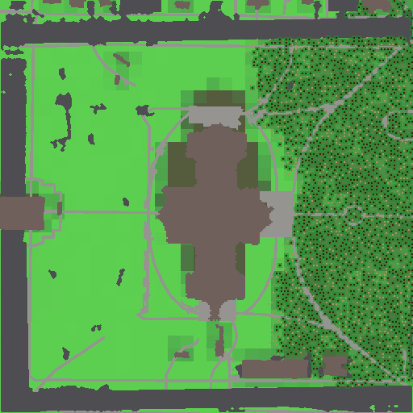

# Shot G3 — the Capitol reference run

The run this reports on:

```
ecosim run --world worlds/capitol --seed 42 --ticks 20000 --out runs/capitol-s42 --set animals.enabled=false
ecosim check runs/capitol-s42
python sweeps/capitolG3/report.py runs/capitol-s42 sweeps/capitolG3   # report.txt, vegetation-20000.png
```

256 × 256 × 32 columns over the committed `worlds/capitol` bundle (512 × 512 ground cells at 0.5 m),
format version 4, snapshot every 100, animals off. `report.txt` is the script's raw output;
`check.txt` is the checker's.

## 1. Event-log cause breakdown

Animals are off, so trees and ground cover are the whole log: 14,007 events.

| species | kind | cause | events |
| --- | --- | --- | --- |
| tree | germination | — | 7933 |
| tree | tree_death | crowded | 4075 |
| tree | tree_death | old_age | 1617 |
| tree | tree_death | drought | 25 |
| tree | tree_death | burnt | 17 |
| ground cover | ignition | — | 89 |
| ground cover | spread | — | 81 |
| ground cover | burnout | — | 170 |

Ground cover (grass and shrub) has no per-species rows: the only events it produces are fire, and
`ignition`, `spread` and `burnout` are logged against a patch with an empty species field. 89 fires
started, 81 spread to a neighbour, 170 patches burnt out — every fire ends.

Tree mortality is crowding-dominated (4075 of 5734 deaths, 71%), then old age (28%). Drought takes
25 and fire 17. That ratio is the signature of a site that fills up: 7933 germinations against 5734
deaths over 20000 ticks.

## 2. Imported versus simulated trees

| tick | total | imported alive | germinated alive | mature | young | sapling | canopy columns | canopy % of the 43,831 plantable |
| --- | --- | --- | --- | --- | --- | --- | --- | --- |
| 0 | 79 | 79 | 0 | 79 | 0 | 0 | 711 | 1.6% |
| 10000 | 1519 | 0 | 1519 | 1036 | 194 | 289 | 7533 | 17.2% |
| 20000 | 2278 | 0 | 2278 | 1602 | 4 | 672 | 11855 | 27.0% |

Loading the bundle gives `scene: 81 trees -> 79 planted (0 moved, 2 dropped, 0 merged); 64 shrubs
over 750 columns in 87 patches`, which is what `tests/bundle.rs` pins. The two dropped trees stand
at (241, 242) and (182, 243), both on Rock with no plantable column within the 2 m move radius —
street trees in the parking strip on the north edge. Nothing needed moving and no two trees shared a
column, so the scene's own spacing already satisfies one trunk per column.

**The imported wood does not last the run.** Every scene tree imports at age 1197–3000 (heights
4.67–23.59 m, mean 13.70), and `tree.max_age` is 6000 with `lifespan_jitter` 0.2, so lifespans run
4800–7200 ticks. The imported cohort thins steadily and the last one dies between ticks 5600 and
5700:

| tick | imported alive | germinated alive |
| --- | --- | --- |
| 0 | 79 | 0 |
| 1000 | 67 | 52 |
| 2000 | 57 | 172 |
| 3000 | 38 | 269 |
| 4000 | 14 | 444 |
| 5000 | 4 | 672 |
| 5700 | 0 | 779 |

That is the intended behaviour of the mapping (a 20 m street tree is old, not new), but it means the
Capitol's *arrangement* of trees only sets the first ~5000 ticks; after that the canopy is the sim's
own. Canopy fraction still climbs from 1.6% to 27.0% of plantable ground.

## 3. Ground

- Rock 21,705 columns of 65,536 (**33.1%**), water 0, plantable soil 43,831 (66.9%).
- Ground cells by medium: lawn 64.8%, asphalt 17.1%, roof 9.4%, concrete 8.7%. There is no `water`,
  `gravel`, `bed`, `mulch` or bare `soil` cell in this crop.
- Patch means: tick 0 grass 0.088 / shrub 0.031 / detritus 0; tick 10000 grass 0.602 / shrub 0.155 /
  detritus 716; tick 20000 grass 0.557 / shrub 0.222 / detritus 1229.

The tick-0 shrub mean of 0.031 is `shrub.initial` plus the scene's 64 shrub ellipses (837 m² in
total, 750 columns, 87 patches raised above the default).

## 4. Building shade

8701 columns (13.3%) have a dark air voxel over their surface. Most of that is the building's own
footprint, which is Rock anyway; only **2056 shaded columns are plantable**, 4.7% of the plantable
ground. The script recomputes `world::building_shade` independently and cross-checks it against the
run's own `snap_000000/light.bin`: 8701 dark surface columns, 0 outside the computed shade.

**No tree stands in building shade at tick 0, 10000 or 20000.** None of the 79 imported trees landed
on a shaded column — the scene's trees are on lawn away from the walls — and no seedling has ever
survived there, because `tree.light` needs 60 and a shaded column's surface light is 0, so
`germination_prob` is 0 on every one of those 2056 columns. Building shade is therefore a hard
exclusion in this world, not a handicap: it removes 4.7% of the plantable ground from the canopy
outright. The whole imported cohort was planted in the open and all 79 were dead by tick 5700 of old
age, so there is no shaded-versus-open survival comparison to make.

## 5. The check, and the west half

`ecosim check runs/capitol-s42` **passes**, exit 0 (`check.txt`):

```
PASS no species reaches 0: min trees=229 [margin +228.0000]
PASS no species exceeds 10x its anchor count: trees max=2541 limit=6760 [margin +0.6241]
N/A  grazer cycle: n/a (animals off)
PASS fertility_mean in [40, 220]: [111.88, 208.15] [margin +0.0538]
PASS grass_mean in [0.05, 0.95]: [0.3924, 0.8381] [margin +0.1178]
PASS trees at end >= 1.5x trees at tick 0: 2278 vs 79 (need 118.5) [margin +18.2236]
PASS run time < 30 s per 64x64, at most 90 s: 5935 ms [margin +0.9341]
PASS mature trees at tick 10000 >= 35: 1036 [margin +28.6000]
N/A  at tick 10000 grazers >= 10 and hunters >= 2: n/a (animals off)
```

Wall time **5935 ms** for 20000 ticks on a 256 × 256 world, 16× the reference area — well inside the
30 s per 64 × 64 budget, so CI runs the full 20000 ticks (step 10, on the seed-3 matrix leg).

Nothing was tuned for this run; these are the shipped defaults.

One thing the picture shows that no invariant catches: **the woodland is entirely on the east half.**

- 25 of the scene's trees stand west of x = 128 and 54 east of it. At tick 20000 there are 0 trees
  west and 2278 east.
- The west trees died early and of thirst: 24 of the 30 trees that ever stood there died of
  `drought`, 13 in the first 1000 ticks and 11 in the second, plus 3 burnt and 3 of old age. Only 5
  seedlings ever germinated west of the middle, all before tick 600, and the last western tree died
  at tick 5050.
- `climate.rain_gradient = 0.6` is the cause. Rain at column x is `rain × (1 + 0.6 × (2x/255 − 1))`,
  so the west edge gets 40% of the mean and the east edge 160%. Mean moisture at tick 10000 is 58 in
  the west half against 173 in the east. `tree.dry_moisture` is 30 and `dry_death_ticks` 500.
- It is irreversible. `tree.seed_radius` is 6 columns and `tree.immigration_floor` is 0, so once the
  last western tree dies nothing can disperse back across the gap, even though western moisture has
  recovered to a mean of 167 by tick 20000.

That gradient was set for the 256 × 64 strip, where a west–east climate ramp is the point of the
world. On a 256 m photographed site it is a 2.5× rainfall difference across two city blocks, which
has no ground truth behind it. G3 did not change it (the shot says not to retune), but a garden
planner on real ground should probably run the Capitol at `rain_gradient = 0`, and that is worth
settling before G4 puts storms and runoff on top of it.

## 6. The picture



`vegetation-20000.png`: tick 20000, north up, 512 × 512 — one pixel per ground cell, drawn over the
medium grid. Muted greys and browns are the media (asphalt ring road, concrete walks and plazas, the
Capitol's roof in the middle); green is patch grass density, olive is shrub, the dark green mottle is
canopy cover and each dark dot is a trunk (2278 of them). The east half is closed woodland and the
west half is lawn with not one tree. The shaded ground is not only the Capitol's own north side: the
2056 shaded plantable columns run from x 0 to 242 and y 21 to 255, roughly half of them east, cast
by the blocks around the square as well, and in the eastern woodland they read as the trunk-free
strips on the north sides of the roofs.
