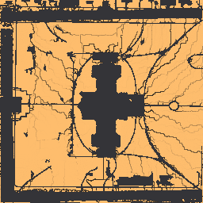

# Shot G5 — nitrogen, phosphorus and potassium

The nutrient tier replaces the 0–255 fertility index with three pools in g/m². Growth reads them
through Liebig's law of the minimum, the pools are returned by litter, corpses and dung, and they
leave by leaching, runoff and fire. `climate.decay_k` was fixed in the same shot: 6.0/yr was a
two-month litter turnover against a published 1–3 years, and it is now 0.45/yr (`ecosim/UNITS.md`
R11, `ecosim/TUNING.md` shot G5).

Everything below is measured, not asserted. The runs are seeds 1, 2 and 3 at the defaults
(`ci-runs/s1..s3`), seed 42 (`runs/s42`), and the Capitol reference world at six deposition rates
(`ci-runs/g5cap/dep*`, the `just capitol` overrides: animals off, rainfall flat).

## Event-log causes, per species, on the reference seeds

20000 ticks = 5 years. Deaths only; `germination`, `birth`, `storm` and the three fire kinds are
left out.

| seed | grazer deaths | hunter deaths | tree deaths |
| --- | --- | --- | --- |
| 1 | 52443 — crowded 39600, eaten 11989, burnt 354, starved 273, old_age 227 | 436 — crowded 252, old_age 117, starved 55, burnt 12 | 4200 — crowded 2245, burnt 1157, drought 618, old_age 180 |
| 2 | 57153 — crowded 43976, eaten 12057, old_age 627, starved 261, burnt 232 | 407 — crowded 272, old_age 103, burnt 29, starved 3 | 2960 — crowded 1855, drought 683, burnt 261, old_age 161 |
| 3 | 46334 — crowded 34116, eaten 8742, old_age 2076, burnt 1089, starved 311 | 318 — crowded 170, old_age 69, burnt 70, starved 9 | 4055 — crowded 3087, drought 475, burnt 209, old_age 284 |
| 42 | 48708 — crowded 35668, eaten 9361, burnt 1498, old_age 1444, starved 737 | 329 — crowded 176, old_age 75, burnt 76, starved 2 | 3498 — crowded 2109, drought 725, burnt 499, old_age 165 |

No `waterlog` row anywhere: the cause exists and is exercised (`forced_tree_extinction_by_waterlogging`),
but it never fires on a reference seed. See "Waterlogging" below.

The mix is the pre-G5 mix. Crowding still dominates every species, predation is still the grazers'
second cause, and drought is still second among trees. That is the point worth taking from the
table: replacing the fertility index with three pools did not move the ecology's causes of death,
it moved what sets the ceiling the crowding presses against.

Ends of the runs, all four within every invariant:

| seed | grazers | hunters | trees | grass_mean | fertility_mean | soil N kg | soil P kg | soil K kg |
| --- | --- | --- | --- | --- | --- | --- | --- | --- |
| 1 | 1725 | 110 | 572 | 0.381 | 68.5 | 0.619 | 47.5 | 21.3 |
| 2 | 2380 | 146 | 782 | 0.424 | 95.6 | 0.683 | 47.9 | 23.0 |
| 3 | 2763 | 62 | 901 | 0.315 | 82.4 | 0.456 | 49.6 | 22.3 |
| 42 | 3248 | 61 | 805 | 0.343 | 73.9 | 0.417 | 49.8 | 24.8 |

## Which nutrient limits growth on the Capitol

At tick 20000, over the 43831 plantable columns of 65536 (`ci-runs/g5cap/dep2.5`, the default
deposition):

| species | limited by N | by P | by K | mean Liebig factor |
| --- | --- | --- | --- | --- |
| grass | 90.1% | 6.9% | 3.0% | 0.292 |
| shrub | 90.1% | 6.9% | 3.0% | 0.241 |
| tree | 90.1% | 6.9% | 3.0% | 0.258 |

The three species agree column for column because their needs are near-proportional (2.5/0.2/2.0,
3.3/0.27/2.7, 3.0/0.25/2.4); what differs is how hard the limit bites, which is the Liebig factor,
not which element it is. Growth reads the patch mean rather than the column, and at that scale the
site is nitrogen-limited almost everywhere: **grass is N-limited on 899 of 905 plantable patches, P
on 6, K on none.** A temperate lawn that nobody fertilises being nitrogen-limited is the expected
answer (UNITS.md R15), and it is the answer the tier gives without being told it.

The 6.9% of columns where P binds instead are not lawn: they are the thin strips along paths and
drains that the P map below traces, where runoff has carried particulate phosphorus away and the
lawn's own N supply has not been touched.

## The pools by where a column stands, tick 20000

A column's group is read from the ground grid: a roof edge has a `roof` cell within 3 m, a street
edge has `asphalt` within 3 m, and mid-lawn has `lawn` within 3 m and nothing sealed. Available P
is the stored pool × `npk.p_avail_frac` (0.1), which is what growth sees.

| group | columns | N g/m² | available P g/m² | K g/m² |
| --- | --- | --- | --- | --- |
| roof edge | 2975 | **0.434** | 4.694 | 25.368 |
| street edge | 5876 | **0.296** | 3.966 | 21.061 |
| mid-lawn | 24517 | **0.331** | 4.695 | 25.223 |
| other soil | 10463 | 0.318 | 4.341 | 22.608 |
| (pipe inlet, 3 m) | 79 | 0.306 | 5.029 | 20.239 |

**A roof edge carries 31% more nitrogen than mid-lawn, and a street edge 11% less.** The same
ordering holds in K (25.4 / 21.1 / 25.2) and in P (4.69 / 3.97 / 4.70), so whatever is doing it is
not an N-specific rule.

It is not, as it first looks, roof runoff feeding the strip at its foot. Deposition falls only on
plantable columns and nothing is lifted off a sealed cell — a roof has no pool to give — so a roof
contributes water and no nutrients at all. Two measurements over the same groups say what it is:

| group | mean soil water mm | trees per 1000 columns |
| --- | --- | --- |
| roof edge | 139.8 | **12.1** |
| street edge | 129.9 | 39.3 |
| mid-lawn | 149.3 | 34.5 |
| other soil | 140.7 | 39.1 |

The roof edge is rich because it is nearly empty of trees. A ground cover's uptake is split evenly
across its whole patch (`Sim::npk_spend`), so it cannot draw one column down relative to its
neighbours; a tree draws from the single column it stands in (`Sim::npk_take_column`). The strip at
a roof's foot carries a third the tree density of the open lawn — a roof bars a trunk outright (shot
G12) and shades what it does not bar — so a third of the single-column drawing happens there, and
the pool stays up. The dark speckle over the lawn in the nitrogen map below is the same mechanism
seen the other way round: one dark pixel is one tree.

The street edge is poor for a different reason. It carries the same tree density as the open lawn
but holds 13% less water, and it is the low line the site drains along, so more of the rain that
reaches it passes through rather than staying — which takes N and K down with it and takes P
sideways along the flow lines the phosphorus map traces.

The pipe inlets are reported for completeness and are not downspouts in any physical sense: nothing
routes a pipe before shot G6, so an inlet is a marked spot on a roof and the water still runs off
the roof's own edge. Their 79 columns sit at the roof-edge and street-edge values, as they should.

## Leaching and runoff, per year, on the Capitol

| year | leached N (g) | runoff P (g) | end soil N (kg) |
| --- | --- | --- | --- |
| 1 | 30 | 96 | 0.419 |
| 2 | 47 | 23 | 0.678 |
| 3 | 29 | 9 | 0.568 |
| 4 | 40 | 18 | 0.524 |
| 5 | 22 | 17 | 0.330 |

**About 34 g of nitrogen a year leaves the 65536 m² site below the roots — 0.5 mg/m²/yr against the
2.5 g/m²/yr falling on it**, so leaching is a rounding error in the budget rather than a drain on
it, which is what a soil this hungry for N should do: the pool is small and the vegetation takes
almost all of it before the water can. The four strip seeds agree at 29–31 g/yr.

Phosphorus runoff is front-loaded: 96 g in year 1 against 9–23 g after. Year 1 is the site washing
the loose P off the surfaces it starts with; once the sward closes, the runoff that still leaves
carries much less. P is also the one pool that ends *higher* than it started nearly everywhere,
because nothing on this site is short of it.

## Waterlogging

**`waterlogged_frac` is 0.0000 on every tick of every reference run — all four strip seeds and all
six Capitol runs.** The mechanism is real and tested (`forced_tree_extinction_by_waterlogging`
drowns the species outright), but at the adopted `hydro.waterlog_frac = 1.10` and
`hydro.waterlog_ticks = 400` it never fires on a world that drains.

That is the right answer physically and it is worth being explicit about why, because it means the
two knobs are not calibrated against anything but their definitions. The threshold is 10% above
field capacity, i.e. a profile whose drainable pore space is more than half full on top of being at
capacity, and `hydro.saturation` caps a column at 1.2, so the band that counts is narrow on purpose.
The Capitol does reach it: `ecosim check` puts the world mean above field capacity on 1.4% of ticks.
What it never does is stay there for 400 consecutive ticks — 100 days at `year_len` 4000. On a site
whose lawn drains and whose depressions are all on sealed ground that grows nothing (shot S5), 100
days of standing water at the roots does not happen. A clay soil (a much lower `hydro.store_max`), a
sealed depression that a plantable column drains into, or a `waterlog_ticks` in the tens of days
would exercise it; none of those is the reference world, and none of them was invented to make the
number nonzero.

## Maps, tick 20000, `ci-runs/g5cap/dep2.5`

One pixel per ecology column, north up, non-plantable columns grey, log ramp over the 2nd–98th
percentile of the plantable columns.

| | |
| --- | --- |
|  | Nitrogen, 0.021–0.61 g/m². The most structured of the three: one dark pixel is one tree, drawing its own column down while the ground cover around it draws evenly across the whole patch. The brighter band around the building is the roof edge, where there are hardly any trees to do that. |
|  | Phosphorus, 0.0054–53 g/m². Nearly uniform and nearly saturated: this soil has far more P than anything on it needs, which is why P limits only 6.9% of columns. What the map does show is the drainage network, drawn in dark where runoff has stripped particulate P along the flow lines — the same lines the water tier's ponding picks out. |
|  | Potassium, 0.041–35 g/m². Between the two: enough of it that it limits almost nowhere, but `npk.k_leach_ratio` (0.03 of the N rate) is slow enough that the pattern it does have is the uptake pattern, not the drainage one. |

## Sweep: `npk.n_deposition` ∈ {0, 0.5, 1, 2, 4}

### Seeds 1–3, the reference strip (`strip/sweep.md`, 15 cells, 225 s)

| value | cells passing | first failure |
| --- | --- | --- |
| 0 | 0/3 | `fertility_band` (all three seeds; worst margin −0.273) |
| 0.5 | 2/3 | `fertility_band` (seed 3; −0.032) |
| 1 | 3/3 | — |
| 2 | 3/3 | — |
| 4 | 3/3 | — |

Safe band **[1, 4]**, with the default 2.5 inside it and one grid step from either edge. No species
reaches 0 in any of the 15 cells, including the four that fail: a world with no nitrogen input does
not collapse in five years, it grinds down, and what fails is the fertility floor rather than the
population.

### The Capitol, seed 42 (six runs, the `just capitol` overrides)

| deposition | check | fertility_mean | trees at 20000 | mature at 2.5 yr |
| --- | --- | --- | --- | --- |
| 0 | FAIL `fertility_band`, FAIL `max_10x` | [26.0, 197.4] | 2947 | 545 |
| 0.5 | FAIL `fertility_band` | [34.6, 189.3] | 3371 | 2373 |
| 1 | FAIL `fertility_band` | [38.0, 195.1] | 3591 | 847 |
| 2 | FAIL `max_10x` | [65.9, 211.5] | 2246 | 55 |
| **2.5 (default)** | **pass** | [67.4, 205.1] | 1522 | 86 |
| 4 | pass | [118.3, **219.1**] | 432 | 49 |

The Capitol closes the band from above where the strip does not. At deposition 4 the fertility index
reaches 219.1 against a ceiling of 220 — a margin of 0.004 — so 4 is the last value that passes
rather than a comfortable one, and the default at 2.5 sits between a lower edge at 1 and an upper
edge just past 4. Raising deposition also costs trees on this site (432 at 4 against 1522 at 2.5):
richer soil grows a denser sward, the sward wins the columns, and fewer saplings get established.

The `max_10x` failure at 2 and not at 2.5 is not a nutrient effect. It compares the tree peak with
the count at 1.25 years, and on a world seeded with 79 imported trees that anchor is small enough
that the ratio swings on when the first germination wave lands. It fails at 0 and 2 and passes at
0.5, 1, 2.5 and 4, which is the signature of an anchor, not of a gradient.

## Reproducing

```
ecosim sweep --param npk.n_deposition --values 0,0.5,1,2,4 --seeds 1,2,3 --ticks 20000 \
  --out sweeps/shotG5/strip --jobs 6
for v in 0 0.5 1 2 2.5 4; do
  ecosim run --world worlds/capitol --seed 42 --ticks 20000 --snapshot-every 10000 \
    --set animals.enabled=false --set climate.rain_gradient=0 --set npk.n_deposition=$v \
    --out ci-runs/g5cap/dep$v && ecosim check ci-runs/g5cap/dep$v
done
python sweeps/shotG5/report.py ci-runs/g5cap/dep2.5 sweeps/shotG5 > sweeps/shotG5/capitol-report.txt
```

`strip/cells/` is gitignored (78 MB of per-cell `series.csv`); `strip/sweep.csv`, `strip/sweep.md`,
`capitol-report.txt` and the three PNGs are committed.
