# Re-accept, shot 16: renderer dims sync

Every reference changes. `runs/s42` is now the reference world at defaults: the 256×64×32 strip, format 3
(ecosim shot 15). Before this shot, CI pinned the run to the old 64×64 square world. Each composite below shows the
old reference on the left and the new one on the right, both at half scale. The diff is the share of the page's
pixels that pixelmatch (threshold 0.1) marks as different.

| Shot | Old \| new | Diff | Why the change is correct |
|---|---|---|---|
| 01_material_t0_iso | 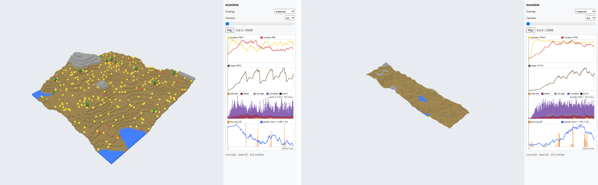 | 15.4% | Same camera offsets scaled by the longest side (256/64). The strip reads as a diagonal band across the view. |
| 02_material_t10000_iso | 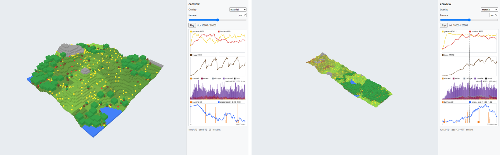 | 18.3% | Strip framed as in 01. The dry, grassy west and the forested east with its pond follow the rain gradient. |
| 03_light_t10000_top | 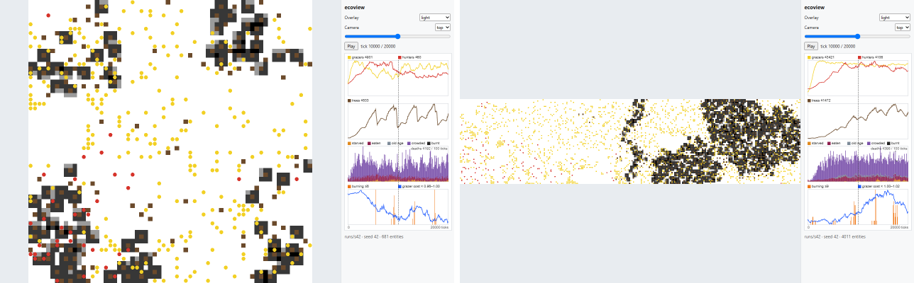 | 21.6% | Top camera fits width×depth, so the 4:1 strip is letterboxed to rows 280–519. Canopy shade sits where the trees are, mostly east. |
| 04_moisture_t10000_top | 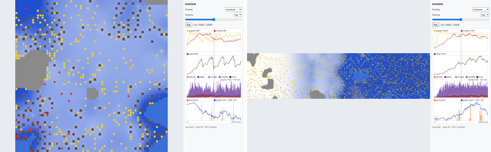 | 62.3% | Letterboxed strip. Moisture runs from white (dry west) to deep blue (wet east), which is `climate.rain_gradient` 0.6. |
| 05_fertility_t10000_top | 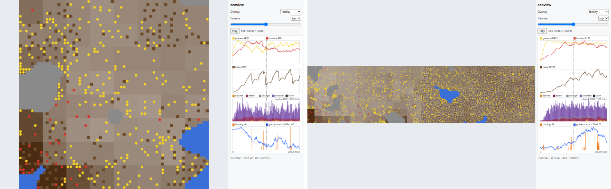 | 53.7% | Letterboxed strip. Fertility is new data from the new world. |
| 06_temperature_t1000_top | 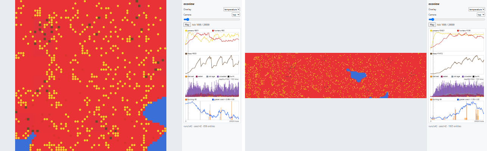 | 51.6% | Letterboxed strip, still all warm (red) at tick 1000. |
| 07_temperature_t3000_top | 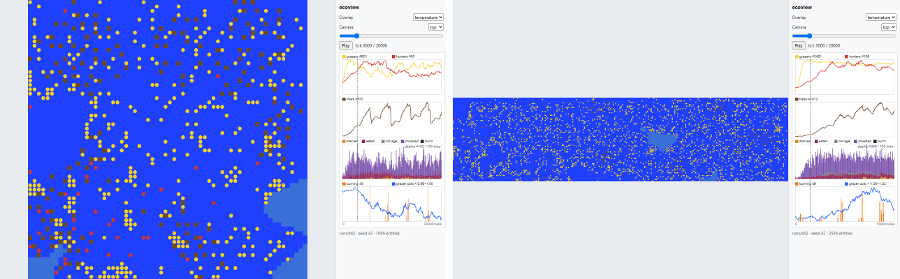 | 52.4% | Letterboxed strip, still all cold (blue) at tick 3000. |
| 08_chart_t20000 | 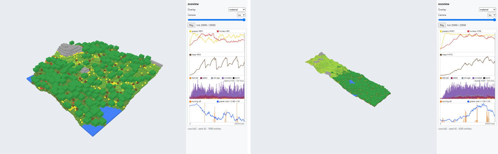 | 17.9% | Same iso framing as 02. The chart plots the strip's series, which has about 4× the populations. |
| 09_fire_t17300_top → 09_fire_t17100_top | 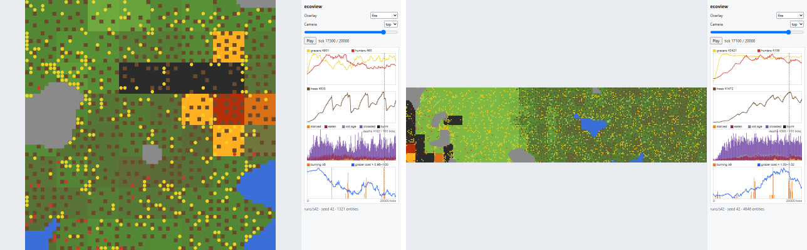 | 62.6% | The fire shot moves to 17100, the strip snapshot with the most patches burning (3, all at the west end). Burnt ground is now the burnout events since the last snapshot, not inferred from bare cover. |
| 10_crowding_t20000_top | 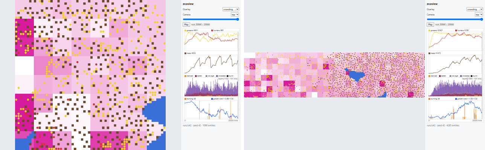 | 43.1% | Letterboxed strip. Crowded patches, in magenta, sit mostly in the grassy west. |
| 11_traits_t20000_top | 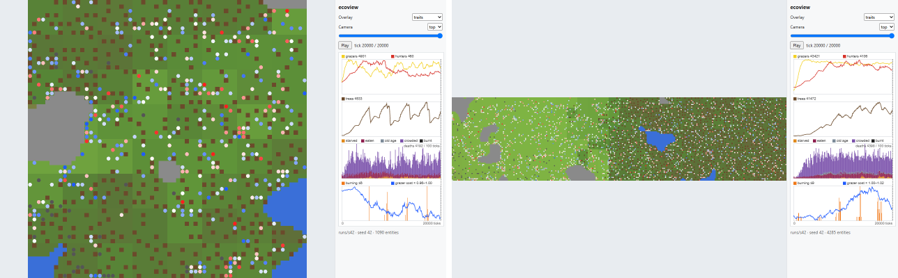 | 57.7% | Letterboxed strip. Grazers are split around the default cost (1591 below, 1506 above), so blue and red appear in about equal numbers. |

Row 09 compares the old 17300 reference with the new 17100 one. The file name changed with the tick.
