# Re-accept, shot E1: the water tier's run, and the two editor references

All 11 strip references change, the 4 Capitol references do not, and 2 new editor references join them. Each
composite below shows the old reference on the left and the new one on the right, both at half scale. The diff is
the share of the page's 1280×800 pixels that pixelmatch (threshold 0.1) marks as different — the same measure
`npm run shot:check` gates at 2%.

**The renderer did not move a pixel.** The cause is on the sim side: ecosim shot G4 (`b22ffc8`) regenerated
`runs/s42` with the water tier on, so `scripts/sync-data.sh` copied a different run — new format (4), new
`series.csv`, new snapshots — under a viewer that reads it the same way as before. Proof: with shot E1's three new
source files held aside and the working tree built from the committed sources at `b22ffc8`, `npm run shot` produced
the same percentages against the old references, to three decimals. Nothing in `loader.ts`, `world.ts`,
`entities.ts` or `ui.ts` changed for shots 01–15 in this shot; `edit.ts` is new and only runs under `?world=`.

Every page carries the sidebar chart, which redraws from the new `series.csv`, so about 9,100 pixels (0.89% of the
page) differ in every one of the eleven. Shot 01 is nothing but that: at tick 0 the world is the same heightmap and
not one pixel of `#view` differs.

| Shot | Old \| new | Diff | View \| sidebar | Why the change is correct |
|---|---|---|---|---|
| 01_material_t0_iso | 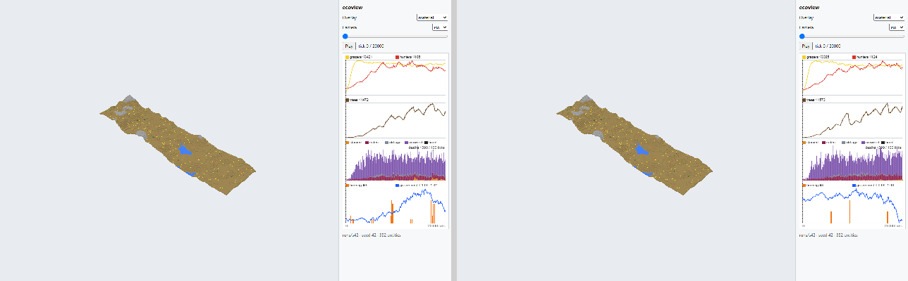 | 0.880% | 0 \| 9,015 | The tick-0 world is untouched — the heightmap, the ponds, the 332 starting entities all render identically. The whole diff is the chart panel plotting the new run. |
| 02_material_t10000_iso | 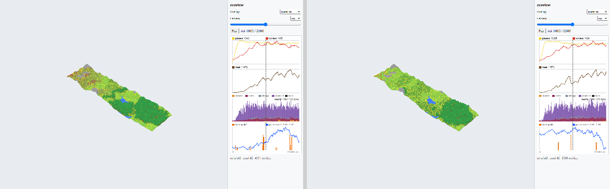 | 2.239% | 13,809 \| 9,116 | 608 trees at tick 10000 where the old run had 813, and grass at 0.755 nearly everywhere instead of a dry west: with soil water spread by the flow graph, the strip greens up and the forest concentrates in the east. |
| 03_light_t10000_top | 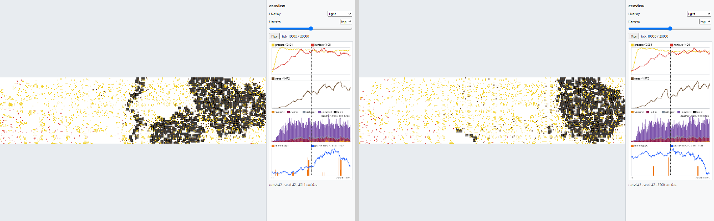 | 8.439% | 77,304 \| 9,116 | Shade follows the canopy, so the black mass moved east with it. Dark 11.4% (was 16.2%), light 75.8% (was 69.3%) — still well inside the ≥5% / ≥40% expectation. |
| 04_moisture_t10000_top | 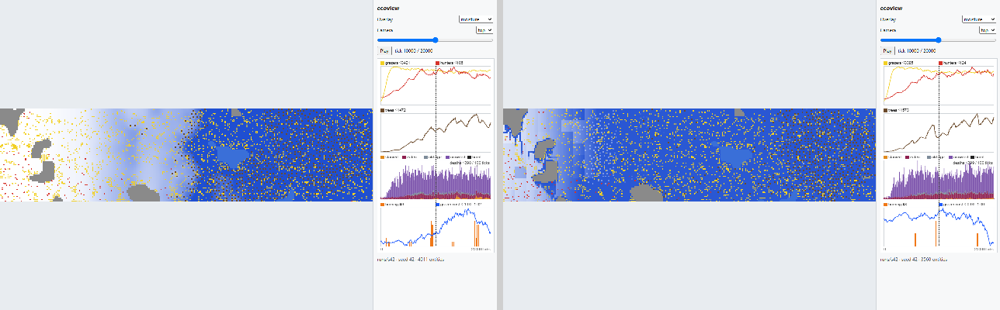 | 14.218% | 136,476 \| 9,116 | The biggest honest change in the set. `moisture` is no longer stored: shot G4 derives it from per-column soil water, which runoff carries downhill. The west-to-east rain ramp is replaced by wet ground almost everywhere (mean 215.9) with dry high ground. |
| 05_fertility_t10000_top | 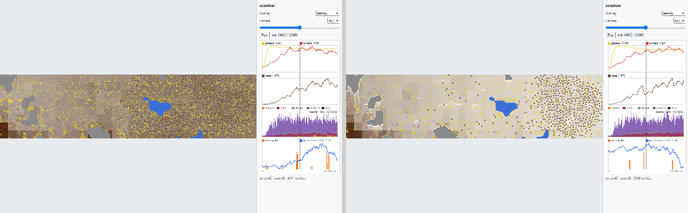 | 18.897% | 184,387 \| 9,116 | Fertility follows litter, and litter follows the trees, which moved. Mean 69.0 over a paler field, with the dark south-west block and an eastern wash of decaying litter. |
| 06_temperature_t1000_top | 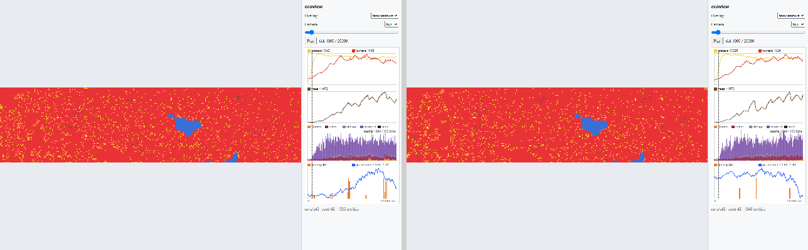 | 3.158% | 23,275 \| 9,065 | Still uniformly warm; what differs is the 1846 entities scattered over it and the ponds, which the water tier now fills at a slightly different level. |
| 07_temperature_t3000_top | 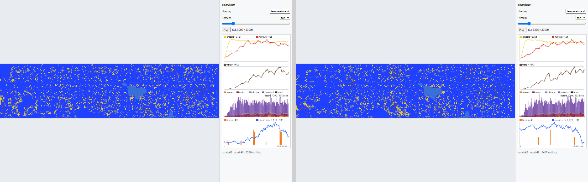 | 4.472% | 36,720 \| 9,076 | Still uniformly cold, same reason: 3457 entities in new places over the same blue field. |
| 08_chart_t20000 | 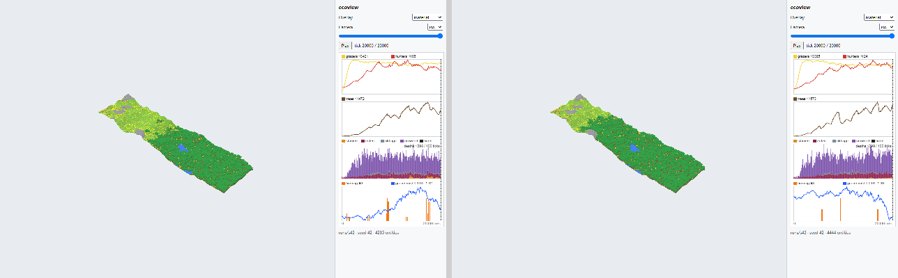 | 1.905% | 10,408 \| 9,102 | The tick-20000 canopy is denser (1414 trees) and the curves are the new run's: grazers ≤3385 (was 3421), hunters ≤124 (was 106), trees ≤1573 (was 1472), burning ≤3 (was 9). |
| 09_fire_t17100_top | 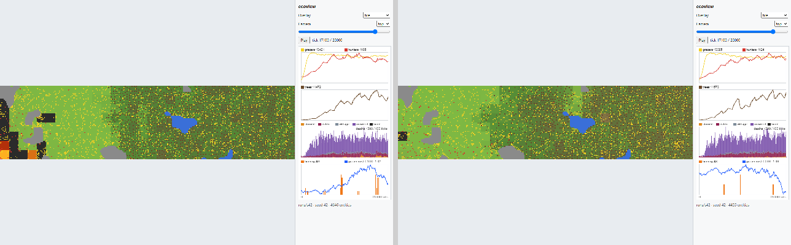 | 8.826% | 81,368 \| 9,007 | The overlay is unchanged; its subject is gone. The old run had three patches burning at this tick and 27 burnouts behind it; the new one has none burning and a single charcoal patch. Fire is nearly extinct under the water tier — 8 ignitions in 20,000 ticks. REPORT.md flags this for the operator; picking a new tick or retuning fire is a sim-side call, not an ecoview one. |
| 10_crowding_t20000_top | 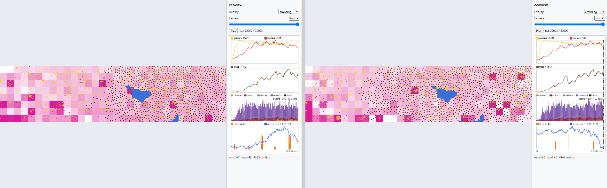 | 11.919% | 112,944 \| 9,102 | 2935 grazers, spread over a wetter, greener strip, so the magenta patches sit in different places — still clustered where grass is thickest. |
| 11_traits_t20000_top | 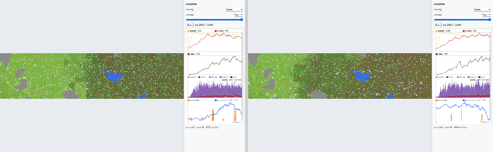 | 8.555% | 78,505 \| 9,102 | Different grazers in different places, and the trait mean drifted below 1.0 (0.990, was 1.005), so the split is 1652 below and 1283 above and blue and white now slightly outnumber red. |

Shots 12–15, the Capitol run, are byte-identical to their references (0.000%): `runs/capitol-s42` was not regenerated.

## New references

| Shot | New | Why it exists |
|---|---|---|
| 16_edit_hotbar | `shots/16_edit_hotbar.png` | Edit mode on the committed bundle: the eight-slot hotbar with `8 building` lit, brush 3, and the outline under the crosshair on the Capitol roof. The SAD's screenshot table has no editor row, because shot E1 is what adds the editor. |
| 17_edit_brush5 | `shots/17_edit_brush5.png` | The brush, from ground level: 49 outlined cells on the lawn beside the east road with `1 lawn` lit and brush 5. Between the two, every element of the edit UI — hotbar, panel, crosshair, outline, both camera heights — appears in a reference. |

Both are deterministic without a mouse: `?eye=` fixes the first-person camera and the crosshair picks the centre
cell, so no pointer lock, no clicking, and nothing in them depends on timing (DECISIONS.md, "E1 editor").
