# Re-accept, shot E2: ecosim shot G4b's calibrated runs

Fifteen of the seventeen references change, the two editor references do not, and nothing is added or
removed. Each composite shows the old reference on the left and the new one on the right, both at half
scale. **Diff** is the share of the page's 1280×800 pixels that pixelmatch (threshold 0.1) marks as
different — the same measure `npm run shot:check` gates at 2% — split into the `#view` canvas (x < 960)
and the sidebar (x ≥ 960).

**Shot E2 did not move a pixel, and this re-accept is not its work.** E2 changes
`tests/e2e/perf.spec.ts` and `DECISIONS.md` and nothing else; no source file, no shot script, no data.
Proof: with those two files reverted to `0190df9` and the tree rebuilt, `npm run shot` produced all 17
PNGs **byte-identical** to the ones accepted here (`cmp` over every file, 0 differences).

The cause is on the sim side. Ecosim shot G4b (`97119d9`, units and time calibration) is on this branch,
and the ecoview CI job regenerates the two runs the renderer draws from whatever ecosim is on the branch:

```
ecosim run --seed 42 --ticks 20000 --out runs/s42 --snapshot-every 100 --set hydro.enabled=false
ecosim run --world worlds/capitol --seed 42 --ticks 20000 --out runs/capitol-s42 --snapshot-every 1000 \
  --set animals.enabled=false --set climate.rain_gradient=0 --set hydro.enabled=false
```

Both were regenerated here with the same two commands before the shot's gate was run, so the references
now match what CI renders. G4b could not have done this itself: MASTER's component isolation forbids an
ecosim shot from editing `ecoview/`, and `shot:check` is skipped in CI on Linux because the references
were rendered on Windows, so no job was red from it and the drift went unrecorded until now.

**The two numbers behind almost every row.** G4b cut the strip's rainfall from about 4200 mm a
simulated year to 887 mm, Lansing's normal being ~800 mm, and recalibrated a tree's water draw from a
hard-coded 50 index units per 50-tick update to a measured 6.4. Together those give a drier west and far
more trees: 1145 trees at tick 10000 where the old run had 608, and 2875 at the Capitol where it had
1982.

| Shot | Old \| new | Diff | View \| sidebar | Why the change is correct |
|---|---|---|---|---|
| 01_material_t0_iso | 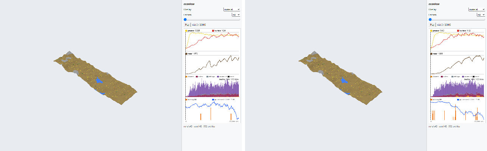 | 0.913% | 0 \| 9,347 | Tick 0 is untouched: the same heightmap, the same two ponds, the same 332 starting entities, not one pixel of `#view` different. The whole diff is the sidebar chart plotting the new `series.csv`. |
| 02_material_t10000_iso | 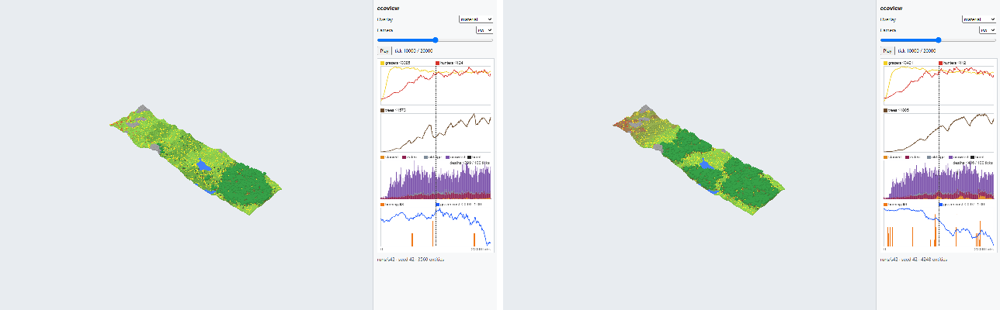 | 2.484% | 16,008 \| 9,432 | 1145 trees at tick 10000 against 608, and 4248 entities against 3560. The closed canopy spreads from the eastern third over the middle of the strip, and the far west end turns tan where the calibrated rainfall no longer keeps grass up (grass mean 0.563, was 0.755). |
| 03_light_t10000_top | 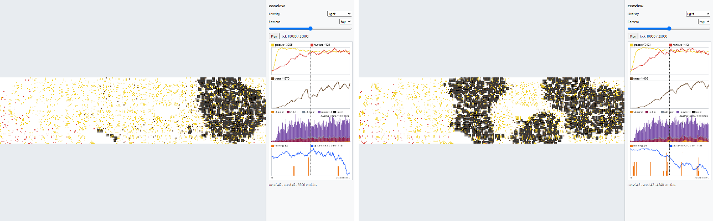 | 10.280% | 95,835 \| 9,432 | Shade follows the canopy, and there is twice as much of it: one eastern black mass becomes three, over the east, the centre and the near-west. Measured over world pixels only, 23.1% dark and 59.4% light, still inside the expectation of ≥5% dark and ≥40% light. |
| 04_moisture_t10000_top | 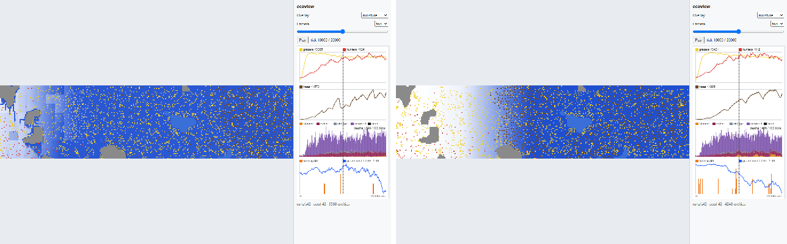 | 12.458% | 118,134 \| 9,432 | The largest honest change in the set, and the clearest picture of the calibration. At 4200 mm a year the strip saturated and the overlay was flat deep blue (mean 215.9); at 887 mm the west-to-east rain ramp shows as it should — white dry ground in the west grading to wet blue in the east, mean 175.0. |
| 05_fertility_t10000_top | 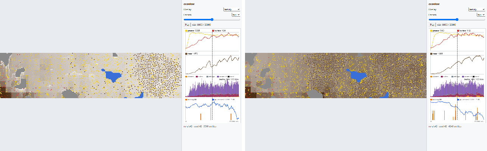 | 18.699% | 182,043 \| 9,432 | The biggest percentage, and it is one flat shift: fertility mean 150.8 against 69.0, so the pale tan field goes uniformly mid-brown. Litter is what makes fertility, and there are nearly twice as many trees dropping it. |
| 06_temperature_t1000_top | 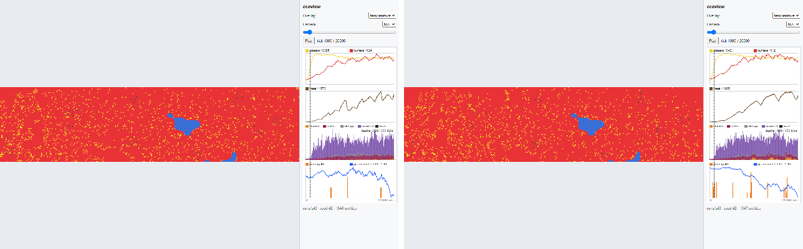 | 3.098% | 22,337 \| 9,386 | Still uniform summer red at 26.98 °C; what differs is the 1947 entities scattered over it (was 1846) and the ponds, which sit at a slightly different level. |
| 07_temperature_t3000_top | 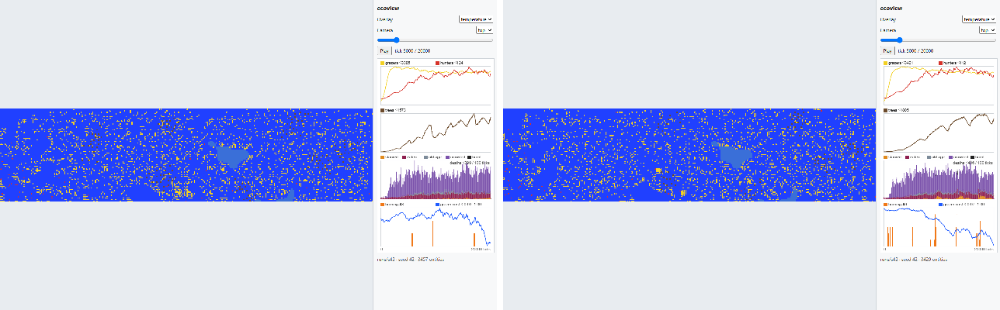 | 4.536% | 37,061 \| 9,387 | Still uniform winter blue at −3.08 °C, same reason: 3429 entities in new places over the same field. |
| 08_chart_t20000 | 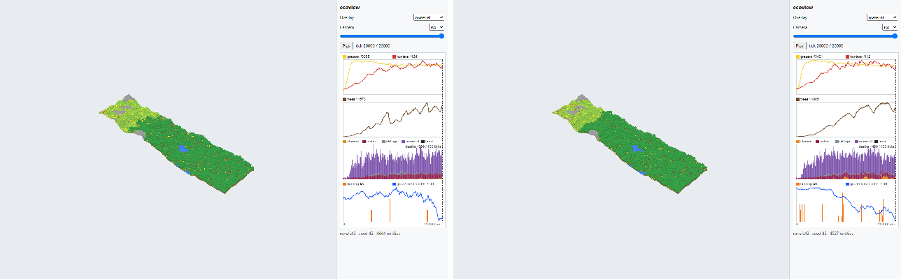 | 1.648% | 7,452 \| 9,428 | The new run's curves: grazers peak 3421 (was 3385), hunters 112 (was 124), trees 1805 (was 1573), patches burning 6 (was 3). The iso view behind it holds 4527 entities against 4444. |
| 09_fire_t17100_top | 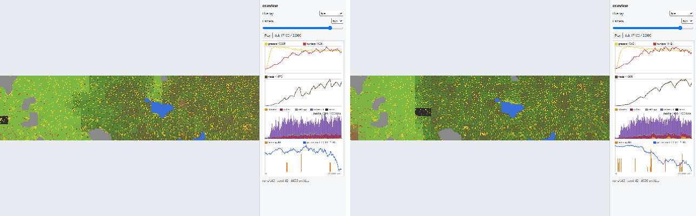 | 8.221% | 74,817 \| 9,365 | The overlay is unchanged; its subject moved. Two charcoal patches at the west edge instead of one (2 burnouts between ticks 17000 and 17100, was 1), over a material colour that changed with the canopy. Fire is more alive than it was: 37 ignitions, 189 spreads and 226 burnouts in 20,000 ticks, against the 8 / 5 / 13 shot E1 recorded — see the note below. |
| 10_crowding_t20000_top | 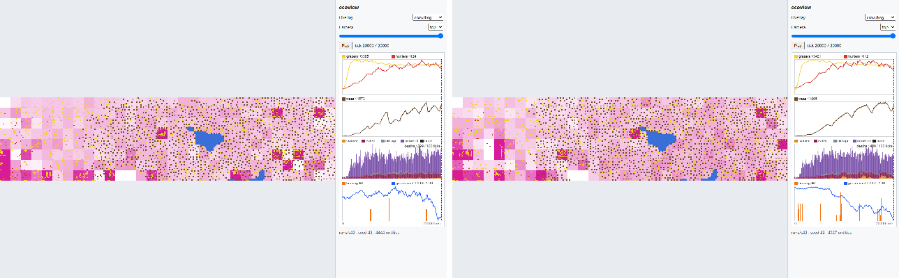 | 11.661% | 109,979 \| 9,428 | 2898 grazers against 2935, in different places over a differently-grown strip, so the magenta squares move. The white (empty) patches now cluster at the dry west end, which is where the crowding picture should be thinnest. |
| 11_traits_t20000_top | 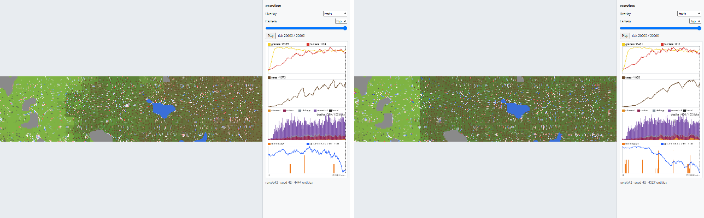 | 7.211% | 64,411 \| 9,428 | Different grazers in different places, and the mean `energy_cost_mult` drifted further below the default: 0.974 (was 0.990), so the split is 1743 below 1.0 and 1155 above and blue clearly outnumbers red. |
| 12_capitol_medium_t0_iso | 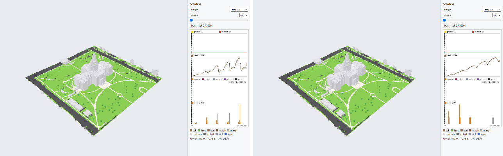 | 0.213% | 0 \| 2,178 | Tick 0 of the Capitol: the site is identical, the bundle did not change. The diff is entirely the chart panel, which plots the new `series.csv`. |
| 13_capitol_medium_t0_top | 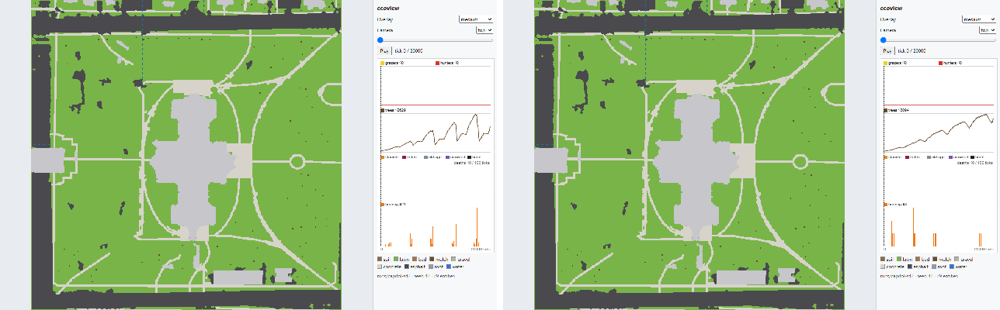 | 0.213% | 0 \| 2,178 | Same, from the top camera. |
| 14_capitol_light_t0_top | 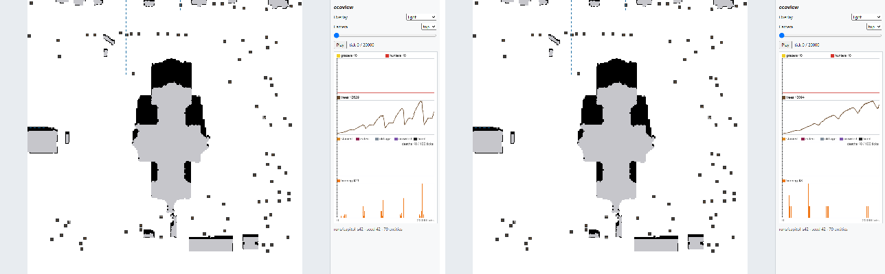 | 0.213% | 0 \| 2,178 | Same. The building shade and the 79 starting trees are unchanged at tick 0. |
| 15_capitol_material_t20000_iso | 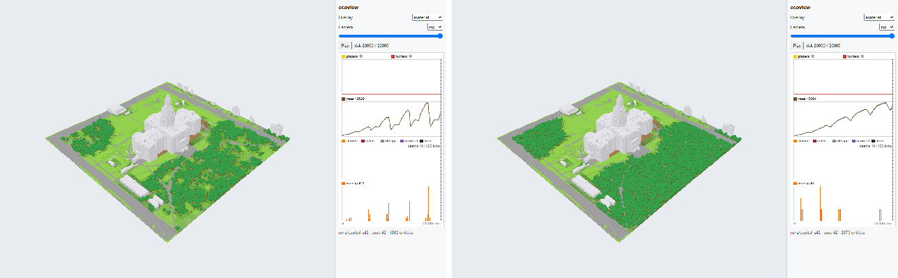 | 3.333% | 31,868 \| 2,257 | 2875 trees against 1982 — the lawns close over almost completely, including the north-west corner that was thin before. The roofs, streets and walks are still bare: the sim plants only on Soil, and the bundle lays paving down as Rock. |

Shots `16_edit_hotbar` and `17_edit_brush5` are byte-identical to their references (0.000%). They load the
committed bundle through `?world=` with no run behind them, so no sim change can reach them.

## Two findings for the operator

**Fire came back, and shot 09's tick is now the wrong one.** Shot E1 recorded 8 ignitions in 20,000 ticks
and flagged it as the open question behind backlog row G4d. On G4b's calibration the same seed gives **37
ignitions, 189 spreads and 226 burnouts**, and `patches_burning` reaches 6 (tick 17137). That is a partial
answer to G4d from the sim side: fire was mis-scaled against the old moisture units rather than genuinely
absent. It does not settle whether a watered garden site should burn, which is still a direction call.
Shot 09's tick, 17100, was chosen when it was the snapshot with the most patches alight (3). It now shows
**0 burning and 2 burnt**; the best snapshot tick in this run is 9500 or 13400, with 2 burning. Moving the
tick means editing `scripts/shots.mjs` and adding a reference, which is not what shot E2 was asked to do,
so the tick is left alone and recorded here and in `REPORT.md`.

**The Capitol run's `fertility_mean` ends at 222.85, over the 220 ceiling** the operator flagged before
G4 started. This is the renderer's pinned Capitol run (`hydro.enabled=false`), which no CI job passes
through `ecosim check`, so nothing goes red — but it is the crossing that note predicted, one shot early
and on the reference site rather than a denser one. It is a sim-side number; G5 replaces the field
outright.
