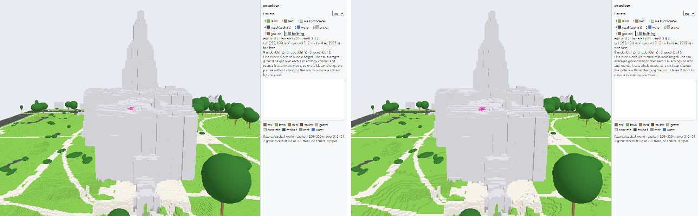
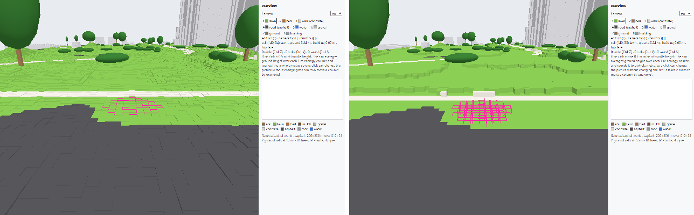

# Re-accept, shot E3: the two editor references become a block world

Two of the seventeen references change, `16_edit_hotbar` and `17_edit_brush5`, and they are the only two
rendered from a `?world=` bundle page. The fifteen run references (`01`–`15`) are byte-identical to their
references at 0.000%, including the four Capitol run shots: a run page draws its ground through
`GroundDrape` and `Buildings`, which this shot does not touch, so nothing on the sim side of the renderer
moved. Each composite shows the old reference on the left and the new one on the right, both at half
scale. The diff is the share of the page's 1280×800 pixels that pixelmatch (threshold 0.1) marks as
different — the measure `npm run shot:check` gates at 2%.

| Shot | Old \| new | Diff | View \| sidebar | Why the change is correct |
|---|---|---|---|---|
| 16_edit_hotbar |  | 2.591% | 22,323 \| 4,208 | The Capitol is drawn as cubes on the 0.5 m lattice instead of one stretched prism per column, so the dome and drum step up in half-metre courses and the lawn terraces in contours. The composition is unchanged — same camera, same trees, same walks, same silhouette — because quantising a heightfield for display moves each surface by less than one cube. The sidebar's share is the target line (`side face` where E1 read `top face`: the ray now meets the cube wall it used to pass through) and the note, which is now derived from `ground_cell_m` rather than written as a constant. The brush outline over the roof is nine cube wireframes where it was nine flat squares (change 6). |
| 17_edit_brush5 |  | 7.070% | 68,374 \| 4,023 | The larger diff, and the one that shows the shot. At eye level on the lawn, E1's ground was a field of prism tops each at its own LiDAR height — visible as stipple across the whole middle band. Quantised to cubes, the same ground is flat terraces with clean risers, and the road in the foreground is one asphalt level. The 49-cell brush is the other half: twelve edges per cube standing proud of the grass, where E1 drew one square lying on each cell. No geometry was added or removed under the camera; every pixel that changed is a surface that moved to its cube level or an outline that gained its vertical edges. |

The `#view` figures are pixels inside the 960×800 canvas, the sidebar figures the 320×800 panel beside it,
both counted from pixelmatch's diff mask.

## Why this is not a drift to hide

The E1 references were accepted five days ago against the heightfield renderer. This shot replaces that
renderer's geometry rule on purpose (`DECISIONS.md`, "E3 block world"), so a pixel change in exactly the
two bundle pages is the expected result and no change anywhere else is the check on it. Both new images
were viewed and written up in `shots/REPORT.md`; both still satisfy the SAD's expectation for their row —
hotbar visible with the building slot lit and the crosshair outline on a cell (16), and the 49-cell disc
unmistakable under the crosshair (17).

Accepted with `node scripts/shot-ref.mjs accept 16_edit 17_edit`, which leaves the other fifteen
references and the `PLATFORM` file untouched.
