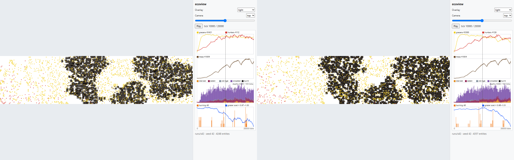
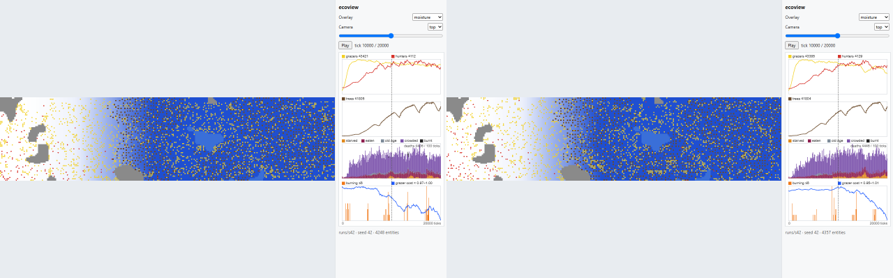
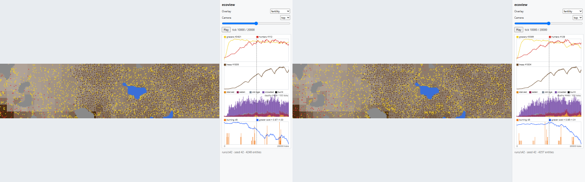
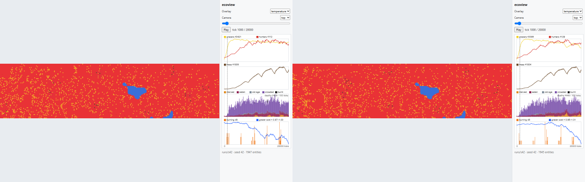
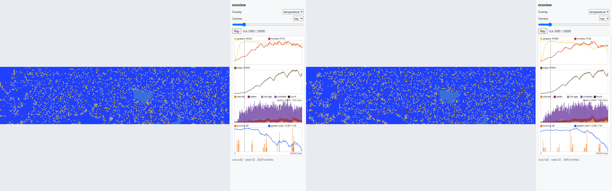
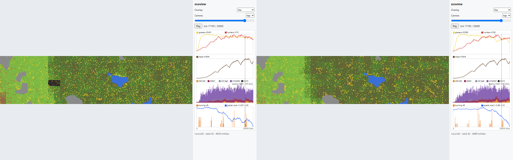
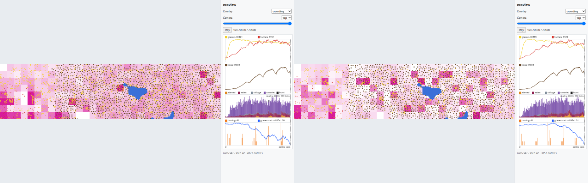
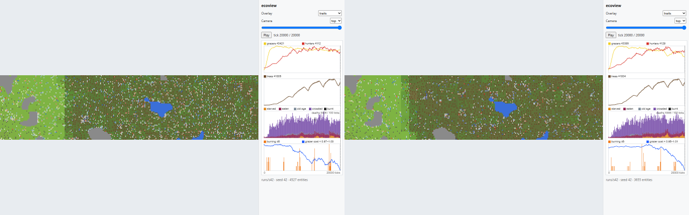
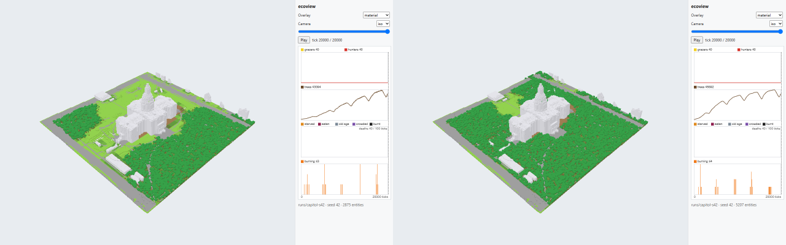

# Re-accept, shot E6: the nine pictures of the simulation

The nine references that show simulated ecology at a nonzero tick are refreshed to ecosim shot G4c's
output; the eight that picture the renderer are untouched and still gated at 2%. Each composite is the
old reference on the left and the new one on the right, both at half scale. **Diff** is the share of the
page's 1280×800 pixels that pixelmatch (threshold 0.1) marks, split into the `#view` canvas and the
sidebar.

**This is not a re-accept under a looser bar, and E6 moved no tolerance.** These nine leave the gate
outright (`scripts/shots.mjs`, `GATED` / `SHOWN`): they are refreshed here so the committed picture
matches what `npm run shot` draws, and from now on their drift is printed and reported but cannot redden
a job. The eight that stay gated stay gated at exactly the same 2%, in exactly E5's regions.

**Shot E6 did not move a pixel of any of them.** Its diff is `scripts/`, `tests/` and prose. The cause is
ecosim shot G4c (`036768f`), which is on this branch and which the ecoview CI job runs before rendering:
light became a fraction of full sun with Beer-Lambert extinction, and a seeding bug was fixed that had
stopped 63 of the Capitol's 79 imported trees from ever seeding. Both runs were regenerated here with
CI's own two commands and `bash scripts/sync-data.sh` before anything was rendered.

**The numbers behind the rows.** The strip carries 1247 trees at tick 10000 against 1145 and 4357
entities against 4248, and it ends with 2006 grazers against 2898. The Capitol goes from 2875 trees to
5207.

| Shot | Old \| new | Diff | View \| sidebar | Why the change is correct |
|---|---|---|---|---|
| 03_light_t10000_top |  | 10.240% | 95,947 \| 8,911 | The shade follows the canopy G4c grew and is drawn by the light rule G4c rewrote. Same three-mass structure, redistributed east, with the far west now clear white. Measured over world pixels only: 24.8% dark and 57.2% light, against 23.1% and 59.4% — still well inside the expectation of ≥5% dark and ≥40% light, which `view.spec.ts` asserts relationally and still passes. |
| 04_moisture_t10000_top |  | 6.299% | 55,595 \| 8,911 | The field itself barely moved — mean 174.91 against 175.0, the same west-to-east ramp, the same ponds and rock. The whole diff is the dots drawn over it: 102 more trees and 109 more entities. |
| 05_fertility_t10000_top |  | 6.256% | 55,146 \| 8,911 | Same again: mean 150.59 against 150.8, the same mid-brown field and pale west corner, a different scatter of entities on top. |
| 06_temperature_t1000_top |  | 3.045% | 22,322 \| 8,858 | Uniform summer red at 26.98 °C, unchanged to two decimals. 1945 entities against 1947, in different places. |
| 07_temperature_t3000_top |  | 4.522% | 37,424 \| 8,880 | Uniform winter blue at −3.10 °C. 3493 entities against 3429, same reason. |
| 09_fire_t17100_top |  | 6.985% | 62,681 \| 8,842 | The overlay is correct and its subject is empty. The old picture had one charcoal block at the west edge from 2 burnouts between ticks 17000 and 17100; on G4c's run there are **no burnout events in that window at all**, so there is no charcoal and, as before, no orange. See the finding below. |
| 10_crowding_t20000_top |  | 15.831% | 153,177 \| 8,937 | The largest change in the set and the most honest one: 2006 grazers at tick 20000 against 2898. The strip goes from evenly pink to pale, with the crowding concentrated in fewer, sharper magenta blocks and more empty white patches between them. G4c's shade cost the grass, and the grass cost the grazers. |
| 11_traits_t20000_top |  | 6.076% | 53,284 \| 8,937 | Fewer grazers in different places, and the mean `energy_cost_mult` drifted further below the default: 0.952 against 0.974. Blue still clearly outnumbers red, which is what the overlay is for. |
| 15_capitol_material_t20000_iso |  | 4.326% | 42,389 \| 1,910 | 5207 trees against 2875 — the seeding fix, not the light. The lawn closes into a near-continuous dark canopy on all four sides of the building. The streets, walks, drive and roofs are still bare, which `capitol.spec.ts` now asserts as a per-tree invariant rather than a share. |

## One finding, carried forward rather than fixed

**Shot 09's tick is now wrong, and more clearly wrong than when shot E2 recorded it.** `09_fire_t17100`
was chosen as the snapshot with the most patches alight. On G4c's run, `patches_burning` peaks at 6 at
tick **8924**, and tick 17100 has no burning patch and no burnout in the preceding hundred ticks, so the
picture shows neither orange nor charcoal. Moving it means editing `scripts/shots.mjs` and adding a
reference, which E6 was not asked to do, so the tick is left alone and this stands as the second shot to
report it. The fire palette itself is still gated, by `overlays.spec.ts`'s test on a synthetic patch
rather than by this picture.
