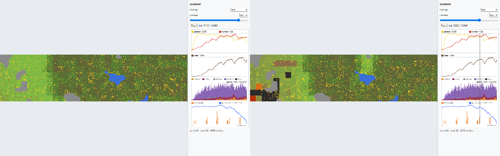

# Re-accept, shot E7: shot 09 moves to a tick where the strip is on fire

One reference changes, and it changes **name**, not content-under-the-same-name:
`09_fire_t17100_top.png` is deleted and `09_fire_t13800_top.png` is added. Nothing else in the set is
re-rendered, re-accepted or moved — `npm run shot:check` reports the other sixteen at exactly the
percentages they had before this shot, and the worst gated view is still `02_material_t10000_iso` at
0.903% of a 2% gate.

The composite below is the **old** reference on the left and the **new** one on the right, both at half
scale. **Diff** is the share of the 1280×800 page that pixelmatch (threshold 0.1) marks between them,
split into the `#view` canvas and the sidebar, measured with `scripts/shot-diff.mjs`.

| Shot | Old (t=17100) \| new (t=13800) | Diff | View \| sidebar | Why the change is correct |
|---|---|---|---|---|
| 09_fire |  | 6.458% | 65,083 \| 1,050 | The old tick pictured nothing. After ecosim shot G4c, tick 17100 has no patch alight and not one `burnout` event in the preceding hundred ticks, so the fire overlay drew the plain material colour and a reader of `shots/REPORT.md` or of the SAD's screenshot table was being shown a fire that was not there. Tick 13800 has both of the things the overlay exists to draw: **2 patches alight** and **16 burnouts in (13700, 13800]** over 11 distinct patches. The diff is not a tolerance being moved — these two files are pictures of two different ticks, and 09 is in the ungated SHOWN group (shot E6) either way, so no gate is involved in this row at all. |

## Why 13800, when the run's peak is 6 patches at tick 8924

Tick 8924 is not a snapshot. `runs/s42` snapshots every 100 ticks, the renderer can only draw a
snapshot, and a fire lasts about 3 ticks (`fire.duration`), so the peak of a spread is almost never on
the 100-tick grid. Across all 201 snapshots of the run, `patches_burning` is nonzero at exactly two:

| Snapshot | Patches alight | Burnouts since the previous snapshot |
|---|---|---|
| 5300 | 1 | 0 |
| 13800 | 2 | 16, over 11 patches |
| *(17100, the old tick)* | *0* | *0* |

13800 is therefore the only snapshot in the run that shows **both** halves of the overlay, and there is
no third candidate to weigh it against. The choice is made by counting, not by taste.

## What is in the new picture

Measured from the PNG, not from the run:

- **2 burning patches**, one 30×30 px block each, which is exactly one 8×8-column patch at the top
  camera's 3.75 px per column. Patch (0, 0), the strip's south-west corner, is `#b3300a` — the
  `burningColor` of one tick left. Patch (1, 2), 8 m east and 16 m north, is `#d97015` — two ticks left.
  The palette reads its age correctly, which is the thing this picture is evidence of.
- **11 charcoal patches**, in two connected regions: 6,847 px covering the western 40 × 32 m, and one
  isolated 874 px block just past that block's north-east corner. Both live fires stand inside the large
  scar, so the picture reads as one fire caught mid-spread rather than as scattered marks.
- The rest of the strip is the material colour with grey rock, the two ponds and 4,516 entities on top.

## What this shot deliberately did not add

**No automatic check that shot 09's tick still has fire in it.** The obvious guard — assert in a test
that the chosen tick burns — would put an ecosim fact back on ecoview's critical path, which is exactly
what shot E6 took off it and what row G11 is finishing. It would also be a gate that reddens the frozen
viewer's job every time the simulator's fire moves, for no renderer defect. The fire palette stays gated
where it belongs, by `tests/e2e/overlays.spec.ts` on a synthetic patch, and the freshness of the *tick*
stays a human verdict in `shots/REPORT.md`, which is where the last two shots did in fact catch it.
